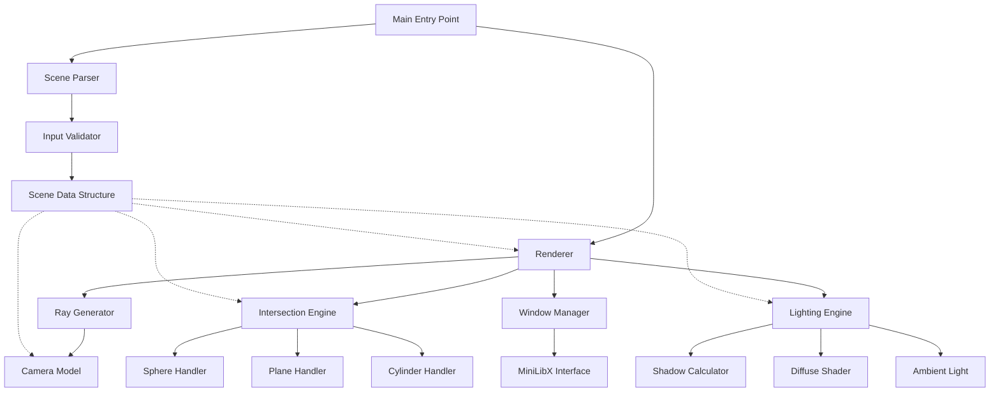

# Design Document

## Overview

The miniRT ray tracer is structured as a modular C application that transforms 3D scene descriptions into 2D rendered images. The architecture follows a pipeline design: scene parsing → ray generation → intersection testing → lighting calculation → pixel rendering. The system emphasizes mathematical precision, memory efficiency, and clean separation of concerns.

The core rendering loop generates one ray per pixel, tests intersections with all scene objects, computes lighting at hit points, and writes the final color to the framebuffer. The design prioritizes correctness and clarity over optimization, making it suitable for educational purposes while remaining performant for typical scene complexity.

## Architecture

### High-Level Component Diagram



### Directory Structure

```
miniRT/
├── Makefile
├── includes/
│   ├── minirt.h           # Main header with all structures and prototypes
│   ├── vector.h           # Vector math operations
│   ├── scene.h            # Scene data structures
│   └── render.h           # Rendering structures
├── src/
│   ├── main.c             # Entry point and program flow
│   ├── parser/
│   │   ├── parse_scene.c  # Main parsing logic
│   │   ├── parse_elements.c  # Element-specific parsers (A, C, L)
│   │   ├── parse_objects.c   # Object parsers (sp, pl, cy)
│   │   ├── parse_utils.c     # String/number parsing utilities
│   │   └── validate.c        # Scene validation
│   ├── math/
│   │   ├── vector_ops.c      # Vector arithmetic (+, -, *, /)
│   │   ├── vector_utils.c    # Dot, cross, normalize, length
│   │   └── matrix.c          # Rotation matrices (if needed)
│   ├── render/
│   │   ├── render.c          # Main render loop
│   │   ├── ray.c             # Ray generation and utilities
│   │   └── camera.c          # Camera setup and coordinate system
│   ├── intersect/
│   │   ├── intersect.c       # Main intersection dispatcher
│   │   ├── sphere.c          # Sphere intersection
│   │   ├── plane.c           # Plane intersection
│   │   └── cylinder.c        # Cylinder intersection (caps + body)
│   ├── lighting/
│   │   ├── lighting.c        # Main lighting calculation
│   │   ├── diffuse.c         # Lambertian diffuse
│   │   ├── shadow.c          # Shadow ray casting
│   │   └── color.c           # Color operations and clamping
│   ├── window/
│   │   ├── window.c          # Window creation and management
│   │   ├── events.c          # Event handling (ESC, close)
│   │   └── image.c           # MLX image buffer operations
│   └── utils/
│       ├── error.c           # Error handling and cleanup
│       ├── memory.c          # Memory management utilities
│       └── debug.c           # Debug output (optional)
├── libft/                    # Your libft library
└── scenes/                   # Test .rt files
    ├── simple_sphere.rt
    ├── multiple_objects.rt
    └── shadow_test.rt
```

## Components and Interfaces

### 1. Scene Data Structures

```c
// Core vector type for 3D coordinates, directions, and colors
typedef struct s_vec3 {
    double x;
    double y;
    double z;
} t_vec3;

// RGB color (0-255 range)
typedef struct s_color {
    int r;
    int g;
    int b;
} t_color;

// Ambient light (singleton)
typedef struct s_ambient {
    double ratio;        // 0.0 to 1.0
    t_color color;
} t_ambient;

// Camera (singleton)
typedef struct s_camera {
    t_vec3 position;
    t_vec3 orientation;  // Normalized direction vector
    double fov;          // Field of view in degrees (0-180)
    // Computed values for ray generation:
    t_vec3 right;        // Camera right vector
    t_vec3 up;           // Camera up vector
    double viewport_width;
    double viewport_height;
} t_camera;

// Light source (singleton in mandatory, multiple in bonus)
typedef struct s_light {
    t_vec3 position;
    double brightness;   // 0.0 to 1.0
    t_color color;       // Parsed but unused in mandatory
} t_light;

// Object type enumeration
typedef enum e_obj_type {
    OBJ_SPHERE,
    OBJ_PLANE,
    OBJ_CYLINDER
} t_obj_type;

// Sphere-specific data
typedef struct s_sphere {
    t_vec3 center;
    double diameter;
    double radius;       // Computed: diameter / 2
} t_sphere;

// Plane-specific data
typedef struct s_plane {
    t_vec3 point;
    t_vec3 normal;       // Normalized
} t_plane;

// Cylinder-specific data
typedef struct s_cylinder {
    t_vec3 center;
    t_vec3 axis;         // Normalized
    double diameter;
    double radius;       // Computed: diameter / 2
    double height;
} t_cylinder;

// Generic object (linked list node)
typedef struct s_object {
    t_obj_type type;
    t_color color;
    union {
        t_sphere sphere;
        t_plane plane;
        t_cylinder cylinder;
    } data;
    struct s_object *next;
} t_object;

// Complete scene
typedef struct s_scene {
    t_ambient ambient;
    t_camera camera;
    t_light light;
    t_object *objects;   // Linked list of all objects
    int obj_count;
} t_scene;
```

### 2. Ray and Intersection Structures

```c
// Ray definition
typedef struct s_ray {
    t_vec3 origin;
    t_vec3 direction;    // Must be normalized
} t_ray;

// Intersection result
typedef struct s_hit {
    bool hit;            // Did the ray hit anything?
    double t;            // Distance along ray to hit point
    t_vec3 point;        // 3D hit point
    t_vec3 normal;       // Surface normal at hit point (normalized)
    t_object *object;    // Pointer to the hit object
    t_color color;       // Object color at hit point
} t_hit;
```

### 3. Rendering Context

```c
// Window and image data
typedef struct s_mlx_data {
    void *mlx;           // MLX instance
    void *window;        // Window pointer
    void *image;         // Image buffer
    char *addr;          // Image pixel data address
    int bits_per_pixel;
    int line_length;
    int endian;
} t_mlx_data;

// Complete program context
typedef struct s_minirt {
    t_scene scene;
    t_mlx_data mlx;
    int width;           // Window width
    int height;          // Window height
} t_minirt;
```

## Data Models

### Scene Parsing Flow

1. **File Reading**: Open .rt file, read line by line
2. **Tokenization**: Split each line by whitespace
3. **Element Identification**: Check first token (A, C, L, sp, pl, cy)
4. **Parameter Parsing**: Extract and validate numeric values
5. **Structure Population**: Fill corresponding data structures
6. **Validation**: Ensure exactly one A, C, L; validate ranges
7. **Post-processing**: Compute derived values (radius from diameter, normalize vectors)

### Coordinate System

- **World Space**: Right-handed coordinate system (X right, Y up, Z forward)
- **Camera Space**: Computed from camera orientation using cross products
- **Screen Space**: 2D pixel coordinates (0,0) at top-left

### Vector Operations Required

```c
// Basic arithmetic
t_vec3 vec_add(t_vec3 a, t_vec3 b);
t_vec3 vec_sub(t_vec3 a, t_vec3 b);
t_vec3 vec_scale(t_vec3 v, double scalar);
t_vec3 vec_divide(t_vec3 v, double scalar);

// Vector math
double vec_dot(t_vec3 a, t_vec3 b);
t_vec3 vec_cross(t_vec3 a, t_vec3 b);
double vec_length(t_vec3 v);
t_vec3 vec_normalize(t_vec3 v);

// Utilities
t_vec3 vec_new(double x, double y, double z);
t_vec3 vec_negate(t_vec3 v);
```

## Intersection Algorithms

### Sphere Intersection

**Mathematical Approach**: Solve quadratic equation for ray-sphere intersection

```
Ray: P(t) = origin + t * direction
Sphere: |P - center|² = radius²

Substituting ray into sphere equation:
|origin + t*direction - center|² = radius²

Let oc = origin - center:
(direction·direction)t² + 2(direction·oc)t + (oc·oc - radius²) = 0

Quadratic form: at² + bt + c = 0
a = direction·direction (= 1 if direction is normalized)
b = 2(direction·oc)
c = oc·oc - radius²

discriminant = b² - 4ac
If discriminant < 0: no intersection
If discriminant >= 0: t = (-b ± √discriminant) / 2a
```

**Implementation Notes**:
- Return smallest positive t value
- Normal at hit point: normalize(hit_point - center)
- Handle inside hits: if t < 0, check second solution

### Plane Intersection

**Mathematical Approach**: Ray-plane intersection using dot product

```
Plane: (P - point)·normal = 0
Ray: P(t) = origin + t * direction

Substituting:
(origin + t*direction - point)·normal = 0
t*direction·normal = (point - origin)·normal
t = (point - origin)·normal / (direction·normal)
```

**Implementation Notes**:
- Check if direction·normal ≈ 0 (ray parallel to plane)
- Return t only if t > 0
- Normal is constant: plane.normal (flip if needed for inside hits)

### Cylinder Intersection

**Mathematical Approach**: Intersection with infinite cylinder + cap tests

```
Cylinder axis: center + s*axis (s is parameter along axis)
Ray: P(t) = origin + t*direction

For infinite cylinder:
|P(t) - (center + s*axis)|² = radius²

This gives a quadratic in t (after eliminating s).
Then check if hit point is within height bounds.
Separately test ray intersection with top and bottom cap planes.
```

**Implementation Steps**:
1. Compute ray-infinite-cylinder intersection (quadratic equation)
2. For each solution, compute s = (hit_point - center)·axis
3. Check if 0 <= s <= height
4. Test ray intersection with cap planes at center and center + height*axis
5. For cap hits, verify distance from axis <= radius
6. Return closest valid intersection

**Normal Calculation**:
- Body: perpendicular from hit point to axis
- Caps: ±axis direction

## Lighting Model

### Ambient Lighting

```
ambient_contribution = ambient_ratio * ambient_color * object_color
```

### Diffuse Lighting (Lambertian)

```
For each light:
    light_dir = normalize(light_position - hit_point)
    cos_angle = max(0, dot(surface_normal, light_dir))
    diffuse_contribution = brightness * cos_angle * light_color * object_color
```

### Shadow Calculation

```
For each light:
    shadow_ray = Ray(hit_point + epsilon*normal, light_dir)
    light_distance = |light_position - hit_point|
    
    For each object:
        if intersect(shadow_ray, object) and t < light_distance:
            light is occluded, skip diffuse contribution
```

**Epsilon offset**: Add small offset (e.g., 0.001) along normal to prevent self-intersection

### Final Color Computation

```
final_color = ambient_contribution + sum(diffuse_contributions for non-occluded lights)
Clamp each RGB component to [0, 255]
```

## Camera and Ray Generation

### Camera Setup

1. **Input**: position, orientation (normalized), FOV
2. **Compute right vector**: cross(orientation, world_up)
   - If orientation parallel to world_up, use alternative up vector
3. **Compute up vector**: cross(right, orientation)
4. **Compute viewport dimensions**:
   ```
   aspect_ratio = width / height
   viewport_height = 2 * tan(FOV / 2)
   viewport_width = viewport_height * aspect_ratio
   ```

### Ray Generation Per Pixel

```
For pixel (x, y) where x ∈ [0, width), y ∈ [0, height):
    u = (x + 0.5) / width        // Normalized [0, 1]
    v = (y + 0.5) / height       // Normalized [0, 1]
    
    // Map to viewport coordinates [-1, 1] range
    viewport_x = (2*u - 1) * viewport_width / 2
    viewport_y = (1 - 2*v) * viewport_height / 2  // Flip Y
    
    // Compute ray direction in world space
    direction = normalize(
        camera.orientation +
        viewport_x * camera.right +
        viewport_y * camera.up
    )
    
    ray = Ray(camera.position, direction)
```

## Rendering Pipeline

### Main Render Loop

```
1. Initialize MLX window and image buffer
2. Setup camera coordinate system
3. For each pixel (x, y):
    a. Generate ray from camera through pixel
    b. Find closest intersection with scene objects
    c. If hit:
        - Compute lighting at hit point
        - Calculate final pixel color
    d. Else:
        - Use background color (black or sky)
    e. Write color to image buffer at (x, y)
4. Display image in window
5. Enter event loop (wait for ESC or close)
```

### Intersection Testing

```
closest_hit = NULL
closest_t = infinity

For each object in scene:
    hit = intersect_object(ray, object)
    if hit.hit and hit.t < closest_t and hit.t > epsilon:
        closest_t = hit.t
        closest_hit = hit

return closest_hit
```

## Error Handling

### Error Categories

1. **File Errors**: File not found, permission denied, invalid extension
2. **Parse Errors**: Invalid format, missing fields, out-of-range values
3. **Scene Errors**: Missing required elements (A, C, L), duplicate singletons
4. **Runtime Errors**: Memory allocation failure, MLX initialization failure
5. **Math Errors**: Division by zero, degenerate vectors

### Error Handling Strategy

```c
// Error reporting function
void error_exit(char *message, t_minirt *rt)
{
    ft_putstr_fd("Error\n", 2);
    ft_putstr_fd(message, 2);
    ft_putstr_fd("\n", 2);
    cleanup(rt);  // Free all allocated memory
    exit(1);
}

// Validation example
if (fov < 0 || fov > 180)
    error_exit("Camera FOV must be between 0 and 180", rt);
```

### Memory Management

- **Allocation tracking**: Keep pointers in main context structure
- **Cleanup function**: Free all allocated memory in reverse order
- **Error cleanup**: Call cleanup before exit on any error
- **MLX cleanup**: Destroy images and windows before freeing MLX instance

## Testing Strategy

### Unit Testing Approach

1. **Vector Math Tests**:
   - Test all vector operations with known inputs/outputs
   - Verify normalization produces unit vectors
   - Test edge cases (zero vectors, parallel vectors)

2. **Intersection Tests**:
   - Test each object type with rays that hit, miss, and graze
   - Verify correct t values and normals
   - Test inside-object scenarios

3. **Parsing Tests**:
   - Valid scene files with all element types
   - Invalid files (missing fields, wrong types, out of range)
   - Edge cases (extra whitespace, comments if supported)

4. **Lighting Tests**:
   - Verify ambient-only rendering
   - Test diffuse with various angles
   - Verify shadows cast correctly

### Integration Testing

1. **Simple Scenes**:
   - Single sphere with light
   - Multiple objects without shadows
   - Shadow casting between objects

2. **Complex Scenes**:
   - All object types together
   - Multiple lights (bonus)
   - Edge cases (camera inside object, overlapping objects)

3. **Visual Regression**:
   - Render reference scenes
   - Compare output images pixel-by-pixel or visually
   - Maintain gallery of expected outputs

### Test Scene Files

```
scenes/
├── unit/
│   ├── sphere_center.rt       # Sphere at origin
│   ├── plane_ground.rt        # Horizontal plane
│   └── cylinder_vertical.rt   # Vertical cylinder
├── integration/
│   ├── three_spheres.rt       # Multiple objects
│   ├── shadow_test.rt         # Shadow casting
│   └── all_objects.rt         # sp, pl, cy together
└── edge_cases/
    ├── camera_inside.rt       # Camera inside sphere
    ├── grazing_angle.rt       # Ray tangent to sphere
    └── overlapping.rt         # Intersecting objects
```

### Manual Testing Checklist

- [ ] Window opens and displays image
- [ ] ESC key closes window cleanly
- [ ] Window close button works
- [ ] No memory leaks (valgrind)
- [ ] No crashes on valid inputs
- [ ] Proper error messages on invalid inputs
- [ ] All objects render correctly
- [ ] Shadows appear where expected
- [ ] Colors match scene file specifications
- [ ] Camera FOV affects perspective correctly

## Performance Considerations

### Optimization Opportunities (Post-MVP)

1. **Spatial Acceleration**: Bounding volume hierarchy for many objects
2. **Early Ray Termination**: Stop at first intersection for shadow rays
3. **Vector Operations**: Inline small functions, use SIMD if allowed
4. **Memory Layout**: Structure packing, cache-friendly data access
5. **Multi-threading**: Parallel pixel rendering (if allowed by subject)

### Current Design Trade-offs

- **Simplicity over speed**: Clear code structure prioritized
- **Linked list objects**: Easy to manage, acceptable for <100 objects
- **No caching**: Recompute everything per pixel (simple, correct)
- **Full precision**: Use double throughout (accuracy over speed)

## Bonus Features Design

### Specular Reflection (Phong Model)

```c
typedef struct s_material {
    double specular_strength;  // 0.0 to 1.0
    double shininess;          // Phong exponent (e.g., 32)
} t_material;

// Add to lighting calculation:
view_dir = normalize(camera_position - hit_point);
reflect_dir = reflect(-light_dir, normal);
spec = pow(max(dot(view_dir, reflect_dir), 0), shininess);
specular_contribution = specular_strength * spec * light_color;
```

### Checkerboard Pattern

```c
// In object structure, add:
bool has_pattern;
double pattern_scale;

// During color calculation:
if (object->has_pattern) {
    int checker = ((int)floor(hit.x / scale) +
                   (int)floor(hit.y / scale) +
                   (int)floor(hit.z / scale)) % 2;
    if (checker)
        color = alternate_color;
}
```

### Multiple Lights

- Change `t_light light` to `t_light *lights` array
- Parse multiple L elements
- Loop over all lights in lighting calculation
- Accumulate diffuse and specular contributions

### Additional Shapes (Cone)

```c
typedef struct s_cone {
    t_vec3 apex;
    t_vec3 axis;
    double angle;  // Half-angle in radians
    double height;
} t_cone;

// Intersection: Similar to cylinder but with varying radius
// radius(s) = s * tan(angle)
```

## Implementation Notes

### MiniLibX Integration

```c
// Initialization
mlx = mlx_init();
window = mlx_new_window(mlx, width, height, "miniRT");
image = mlx_new_image(mlx, width, height);
addr = mlx_get_data_addr(image, &bpp, &line_len, &endian);

// Pixel writing
void put_pixel(t_mlx_data *data, int x, int y, int color)
{
    char *dst = data->addr + (y * data->line_length + x * (data->bits_per_pixel / 8));
    *(unsigned int*)dst = color;
}

// Color encoding
int encode_color(t_color c)
{
    return (c.r << 16) | (c.g << 8) | c.b;
}

// Event hooks
mlx_hook(window, 17, 0, close_window, &rt);  // Close button
mlx_key_hook(window, key_handler, &rt);       // ESC key
mlx_loop(mlx);
```

### Parsing Utilities

```c
// Parse comma-separated triplet "x,y,z"
t_vec3 parse_vec3(char *str);

// Parse comma-separated color "R,G,B"
t_color parse_color(char *str);

// Parse double with error checking
double parse_double(char *str);

// Validate range
bool in_range(double val, double min, double max);
```

### Numerical Stability

- **Epsilon for comparisons**: Use 1e-6 for floating-point equality
- **Shadow ray offset**: Use 1e-4 to prevent self-intersection
- **Normalize checks**: Verify vector length > epsilon before normalizing
- **Discriminant threshold**: Treat small negative discriminant as zero

## Design Decisions and Rationales

1. **Linked List for Objects**: Flexible, easy to add/remove, sufficient performance for expected scene complexity

2. **Union for Object Data**: Memory-efficient, type-safe with enum discriminator

3. **Normalized Vectors**: Store normalized, compute once during parsing, simplifies math

4. **Double Precision**: Accuracy over speed, prevents precision issues in intersection tests

5. **Single-threaded**: Simpler debugging, meets requirements, can parallelize later

6. **No Recursion**: Ray tracing without reflection/refraction doesn't need recursion, simpler stack management

7. **Immediate Mode Rendering**: Render entire image before display, simpler than progressive rendering

8. **Static Window Size**: Simplifies camera setup, can add resize handling later

This design provides a solid foundation for implementing the miniRT project with clear separation of concerns, straightforward algorithms, and room for bonus features.
